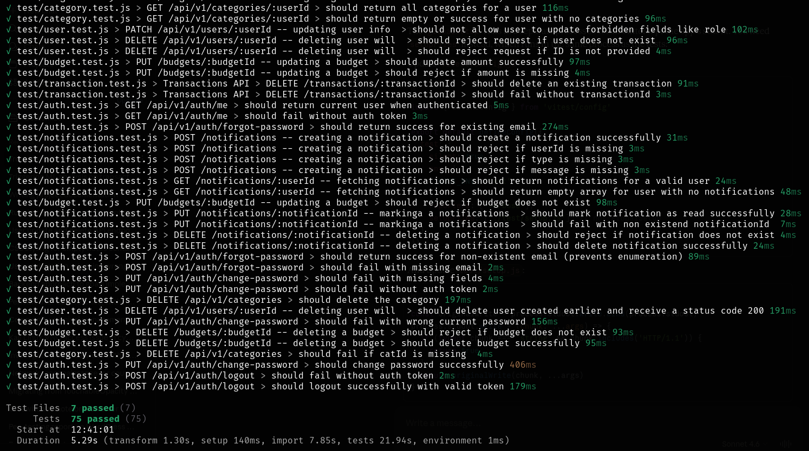

Unit Testing 
===========

Structure
----------

.. code-block:: bash 

    test
    ├── auth.test.js
    ├── budget.test.js
    ├── category.test.js
    ├── goals.test.js
    ├── notifications.test.js
    ├── setup.js
    ├── transaction.test.js
    └── user.test.js

----------------------

The backend test suite is written using *Vitest* and *Supertest*.

Tests are integration-style unit tests that spin up the Express app and make real HTTP requests against it.
Each test file is self-contained: it creates its own test user in ``beforeAll`` and cleans up in ``afterAll`` as required .

.. note::
 
   Tests are located in ``Backend/test/``. Run the full suite with:
 
   .. code-block:: bash
 
      npx vitest run
 
-------------------------

Test Cases
----------

Unit testing includes a total of 75 test cases across 7 test files 

------------

Authentication (``auth.test.js``)
----------------------------------

Tests for all authentication endpoints. A unique test user is created per run using a timestamped email.
The ``accessToken`` and ``refreshToken`` are captured from signup/login and reused across subsequent tests.

POST /api/v1/auth/signup
~~~~~~~~~~~~~~~~~~~~~~~~~

.. list-table::
   :header-rows: 1
   :widths: 60 20 20

   * - Scenario
     - Expected Status
     - Notes
   * - Valid name, email, and password
     - 201
     - Returns ``accessToken`` and ``refreshToken``
   * - Missing email or password
     - 400
     -
   * - Duplicate email
     - 409 or 500
     -

POST /api/v1/auth/login
~~~~~~~~~~~~~~~~~~~~~~~~

.. list-table::
   :header-rows: 1
   :widths: 60 20 20

   * - Scenario
     - Expected Status
     - Notes
   * - Valid credentials
     - 200
     - Returns ``accessToken`` and ``refreshToken``
   * - Wrong password
     - 401 or 500
     -
   * - Non-existent email
     - 401 or 500
     -
   * - Missing email field
     - 400
     -

GET /api/v1/auth/me
~~~~~~~~~~~~~~~~~~~~

.. list-table::
   :header-rows: 1
   :widths: 60 20 20

   * - Scenario
     - Expected Status
     - Notes
   * - Valid Bearer token
     - 200
     - Returns user data in ``body.data``
   * - No token provided
     - 401
     -

POST /api/v1/auth/forgot-password
~~~~~~~~~~~~~~~~~~~~~~~~~~~~~~~~~~~

.. list-table::
   :header-rows: 1
   :widths: 60 20 20

   * - Scenario
     - Expected Status
     - Notes
   * - Existing email
     - 200
     - ``body.success`` is ``true``
   * - Non-existent email
     - 200
     - Returns 200 intentionally to prevent email enumeration attacks
   * - Missing email field
     - 400
     -

PUT /api/v1/auth/change-password
~~~~~~~~~~~~~~~~~~~~~~~~~~~~~~~~~~

.. list-table::
   :header-rows: 1
   :widths: 60 20 20

   * - Scenario
     - Expected Status
     - Notes
   * - Missing request body fields
     - 400
     -
   * - No auth token
     - 401
     -
   * - Wrong current password
     - 401 or 500
     -
   * - Correct current password and valid new password
     - 200
     - ``body.success`` is ``true``

POST /api/v1/auth/logout
~~~~~~~~~~~~~~~~~~~~~~~~~

.. list-table::
   :header-rows: 1
   :widths: 60 20 20

   * - Scenario
     - Expected Status
     - Notes
   * - No auth token
     - 401
     - Logout requires the ``authenticate`` middleware
   * - Valid token and refresh token
     - 200
     - ``body.success`` is ``true``

---

Budgets (``budget.test.js``)
------------------------------

Tests for budget CRUD operations. A test user and a test category are created in ``beforeAll`` and used throughout.

POST /api/v1/budgets
~~~~~~~~~~~~~~~~~~~~~

.. list-table::
   :header-rows: 1
   :widths: 60 20 20

   * - Scenario
     - Expected Status
     - Notes
   * - Valid userId, categoryId, amount, period, and dates
     - 200
     - ``body.data`` is defined; ``budgetId`` captured for subsequent tests
   * - Missing userId
     - 400
     -
   * - Missing categoryId
     - 400
     -
   * - Missing amount
     - 400
     -

GET /api/v1/budgets/:userId
~~~~~~~~~~~~~~~~~~~~~~~~~~~~

.. list-table::
   :header-rows: 1
   :widths: 60 20 20

   * - Scenario
     - Expected Status
     - Notes
   * - Valid userId
     - 200
     - ``body.data`` is an array
   * - userId with no budgets (e.g. 99999)
     - 200
     - Returns empty array

PUT /api/v1/budgets/:budgetId
~~~~~~~~~~~~~~~~~~~~~~~~~~~~~~

.. list-table::
   :header-rows: 1
   :widths: 60 20 20

   * - Scenario
     - Expected Status
     - Notes
   * - Valid budgetId and new amount
     - 200
     - ``body.data.amount`` returns ``"1000.00"``
   * - Missing amount field
     - 400
     -
   * - Non-existent budgetId (e.g. 99999)
     - 404
     -

DELETE /api/v1/budgets/:budgetId
~~~~~~~~~~~~~~~~~~~~~~~~~~~~~~~~~

.. list-table::
   :header-rows: 1
   :widths: 60 20 20

   * - Scenario
     - Expected Status
     - Notes
   * - Non-existent budgetId
     - 404
     -
   * - Valid budgetId
     - 200
     -

---

Categories (``category.test.js``)
-----------------------------------

Tests for category creation, retrieval, and deletion. A test user is created in ``beforeAll``.

POST /api/v1/categories
~~~~~~~~~~~~~~~~~~~~~~~~~

.. list-table::
   :header-rows: 1
   :widths: 60 20 20

   * - Scenario
     - Expected Status
     - Notes
   * - Valid userId, catName, and type
     - 200
     - ``body.success`` is ``true``; ``categoryId`` captured
   * - Missing userId
     - 400
     -
   * - Missing catName
     - 400
     -
   * - Missing type
     - 400
     -

GET /api/v1/categories/:userId
~~~~~~~~~~~~~~~~~~~~~~~~~~~~~~~

.. list-table::
   :header-rows: 1
   :widths: 60 20 20

   * - Scenario
     - Expected Status
     - Notes
   * - Valid userId
     - 200
     - ``body.success`` is ``true``
   * - userId with no categories
     - 200
     - Returns success with empty or null data

DELETE /api/v1/categories
~~~~~~~~~~~~~~~~~~~~~~~~~~

.. list-table::
   :header-rows: 1
   :widths: 60 20 20

   * - Scenario
     - Expected Status
     - Notes
   * - Valid catId in body
     - 200
     - ``body.success`` is ``true``
   * - Missing catId
     - 400, 404, or 500
     -

---

Goals (``goals.test.js``)
---------------------------

Tests for savings goal creation, updates, and deletion. A test user is created in ``beforeAll``.

POST /api/v1/goals
~~~~~~~~~~~~~~~~~~~

.. list-table::
   :header-rows: 1
   :widths: 60 20 20

   * - Scenario
     - Expected Status
     - Notes
   * - Valid userId, goalName, targetAmount, and deadline
     - 200
     - ``body.data`` is defined; ``goalId`` captured
   * - Missing userId
     - 400
     -
   * - Missing goalName
     - 400
     -
   * - Missing targetAmount
     - 400
     -
   * - Missing deadline
     - 400
     -
   * - Zero or negative targetAmount
     - 400
     -

PATCH /api/v1/goals
~~~~~~~~~~~~~~~~~~~~

.. list-table::
   :header-rows: 1
   :widths: 60 20 20

   * - Scenario
     - Expected Status
     - Notes
   * - Valid goalId and newAmount
     - 200
     - ``body.success`` is ``true``
   * - Missing goalId
     - 400
     -
   * - Missing newAmount
     - 400
     -

DELETE /api/v1/goals
~~~~~~~~~~~~~~~~~~~~~

.. list-table::
   :header-rows: 1
   :widths: 60 20 20

   * - Scenario
     - Expected Status
     - Notes
   * - Valid goalId
     - 200
     - ``body.success`` is ``true``
   * - Missing goalId
     - 500
     -

---

Notifications (``notifications.test.js``)
------------------------------------------

Tests for the notifications system, which uses MongoDB. ``initMongoDb()`` is called manually in ``beforeAll``
because MongoDB does not initialise automatically in the test environment.

POST /api/v1/notifications
~~~~~~~~~~~~~~~~~~~~~~~~~~~

.. list-table::
   :header-rows: 1
   :widths: 60 20 20

   * - Scenario
     - Expected Status
     - Notes
   * - Valid userId, type, and message
     - 200
     - ``body.data`` is defined; ``notificationId`` (``_id``) captured
   * - Missing userId
     - 400
     -
   * - Missing type
     - 400
     -
   * - Missing message
     - 400
     -

GET /api/v1/notifications/:userId
~~~~~~~~~~~~~~~~~~~~~~~~~~~~~~~~~~~

.. list-table::
   :header-rows: 1
   :widths: 60 20 20

   * - Scenario
     - Expected Status
     - Notes
   * - Valid userId
     - 200
     - ``body.data`` is an array
   * - userId with no notifications
     - 200
     - Returns empty array

PUT /api/v1/notifications/:notificationId/read
~~~~~~~~~~~~~~~~~~~~~~~~~~~~~~~~~~~~~~~~~~~~~~~

.. list-table::
   :header-rows: 1
   :widths: 60 20 20

   * - Scenario
     - Expected Status
     - Notes
   * - Valid notificationId
     - 200
     - ``body.success`` is ``true``
   * - Non-existent notificationId
     - 400, 404, or 500
     -

DELETE /api/v1/notifications/:notificationId
~~~~~~~~~~~~~~~~~~~~~~~~~~~~~~~~~~~~~~~~~~~~~

.. list-table::
   :header-rows: 1
   :widths: 60 20 20

   * - Scenario
     - Expected Status
     - Notes
   * - Non-existent notificationId
     - 500
     -
   * - Valid notificationId
     - 200
     - ``body.success`` is ``true``

---

Transactions (``transaction.test.js``)
----------------------------------------

Tests for transaction creation, retrieval, and deletion. A test user and test category are created in ``beforeAll``.

POST /api/v1/transactions
~~~~~~~~~~~~~~~~~~~~~~~~~~

.. list-table::
   :header-rows: 1
   :widths: 60 20 20

   * - Scenario
     - Expected Status
     - Notes
   * - Valid userId, categoryId, and amount
     - 200
     - ``body.data.amount`` returns ``"100.00"``; ``transactionId`` captured
   * - Missing userId
     - 400
     -
   * - Missing categoryId
     - 400
     -
   * - Missing amount
     - 400
     -

GET /api/v1/transactions/:userId
~~~~~~~~~~~~~~~~~~~~~~~~~~~~~~~~~

.. list-table::
   :header-rows: 1
   :widths: 60 20 20

   * - Scenario
     - Expected Status
     - Notes
   * - Valid userId
     - 200
     - ``body.data`` is an array
   * - userId with no transactions
     - 200
     - Returns empty array

DELETE /api/v1/transactions
~~~~~~~~~~~~~~~~~~~~~~~~~~~~~

.. list-table::
   :header-rows: 1
   :widths: 60 20 20

   * - Scenario
     - Expected Status
     - Notes
   * - Valid transactionId in body
     - 200
     - ``body.data`` has ``id`` property
   * - Missing transactionId
     - 400
     -

---

Users (``user.test.js``)
--------------------------

Tests for user profile updates and account deletion.
The test user is created via a direct ``fetch`` call to the running server in ``beforeAll``.

PATCH /api/v1/users/:userId
~~~~~~~~~~~~~~~~~~~~~~~~~~~~~

.. list-table::
   :header-rows: 1
   :widths: 60 20 20

   * - Scenario
     - Expected Status
     - Notes
   * - Non-existent userId (e.g. 99999)
     - 404
     -
   * - Empty request body
     - 400 or 500
     -
   * - No userId in URL
     - 404
     -
   * - Valid name update
     - 200
     - ``body.data.name`` reflects the new name
   * - Multiple fields (name, email, currency, language)
     - 200
     - All updated fields reflected in response
   * - Forbidden field (e.g. ``role: "admin"``)
     - 403
     -

DELETE /api/v1/users/:userId
~~~~~~~~~~~~~~~~~~~~~~~~~~~~~~

.. list-table::
   :header-rows: 1
   :widths: 60 20 20

   * - Scenario
     - Expected Status
     - Notes
   * - Non-existent userId
     - 404
     -
   * - No userId in URL
     - 404
     -
   * - Valid userId
     - 200
     -
